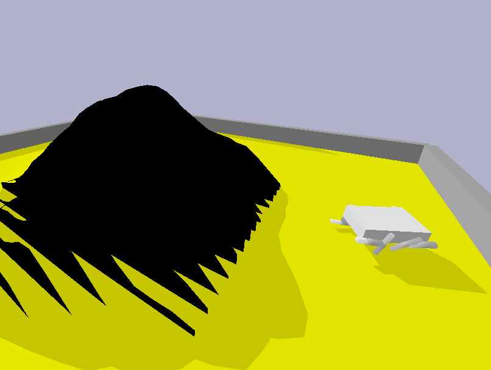

# Evolving Mountain-Climbing Creatures with Genetic Algorithms

*A small study in what happens when you can't quite tell an evolutionary algorithm what you actually want.*

---

## TL;DR

Built a Python genetic algorithm (PyBullet physics) to evolve articulated creatures that climb a procedurally generated mountain. The interesting part wasn't the climbing. It was that the algorithm kept finding creative ways to cheat the fitness function. Every reward design I came up with produced a new unintended behaviour. The documented sequence is a small case study in what ML researchers call *specification gaming*.

**Stack:** Python, PyBullet, NumPy
**Scope:** 30+ logged experiments across two evolution paradigms
**Context:** AI module coursework, BSc Computer Science (University of London)

---

## Code access

Source code, technical report, and recorded demos live in a private repository to respect University of London academic integrity guidelines, since the assignment brief is reused across cohorts. Happy to share full access with recruiters or hiring managers on request.

---

*An evolved creature in the sandboxed PyBullet environment. The Gaussian mountain sits in the middle; the creature's job is to climb it without exploiting the physics or the reward function.*

---

## The problem

A genetic algorithm framework and a physics environment with a procedurally generated mountain in it. The job: evolve creatures, articulated bodies with motors and joints, that climb the mountain. The fitness function I was handed was a placeholder. Designing the real one was the open-ended part.

That ended up being most of the project.

## The GA cheats

You can't tell an evolutionary algorithm what you want. You can only tell it what you'll reward, and whatever you reward it will maximise, usually through a route you didn't think of.

Over thirty experiments, my fitness functions produced:

- Creatures that **flung themselves past the mountain** and off the edge of the arena into infinite space, because distance travelled was being credited as progress.
- Creatures that **grew enormous** and crawled to the mountain base, because rewarding "height after landing" didn't separate climbing from just being tall.
- Creatures that **planted themselves and spun**, registering elevation through a long protruding limb that never touched the slope.
- Creatures that learned to **fling themselves over the peak** after landing, briefly hitting near-zero distance to the target before tumbling out.

Diagnosing each one meant replaying the elite creature in the simulator's GUI and watching what it actually did. The fix was rarely obvious in advance. The fitness function went through several substantial redesigns, each one closing the loophole the previous version had created.

Real ML systems run into the same problem at scale, under labels like *reward hacking* and *Goodhart's law*. It turned up immediately at toy scale and was harder to handle than I expected.

## Beyond the fitness function

About halfway through I started to suspect the bottleneck wasn't the fitness function. It was the search space. Evolving full body morphology and motor control at the same time means most random creatures are non-viable: joints in invalid positions, mass distributions that prevent movement, parts that pass through each other. The GA was spending most of its compute rediscovering basic feasibility before getting near the actual task.

So I switched paradigms. Fixed-body experiments, evolving only motor controls. Smaller search space, faster iterations. I tried quadrupeds and hexapods, with techniques like seeded gaits (initialising the population with hand-designed locomotion patterns) and diversity injection (introducing fresh random individuals each generation to escape local optima).

That produced the project's best results: a fixed quadruped that reliably approached the mountain base and made repeated clumsy attempts at the slope. Still no successful climb.

## Stack

Python 3.8+, PyBullet (DIRECT mode for training, GUI for elite replay), NumPy. Custom experiment logger writing per-generation CSVs, periodic elite checkpointing, URDF serialization for evolved creatures.

---

*Built as part of a BSc Computer Science programme at the University of London.*
